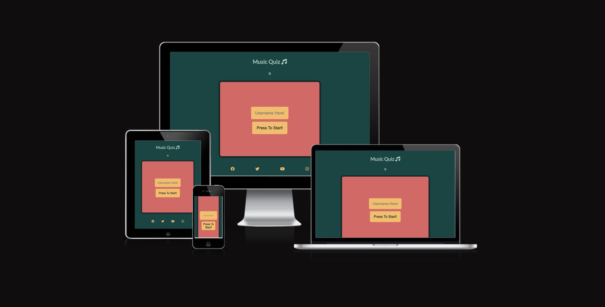
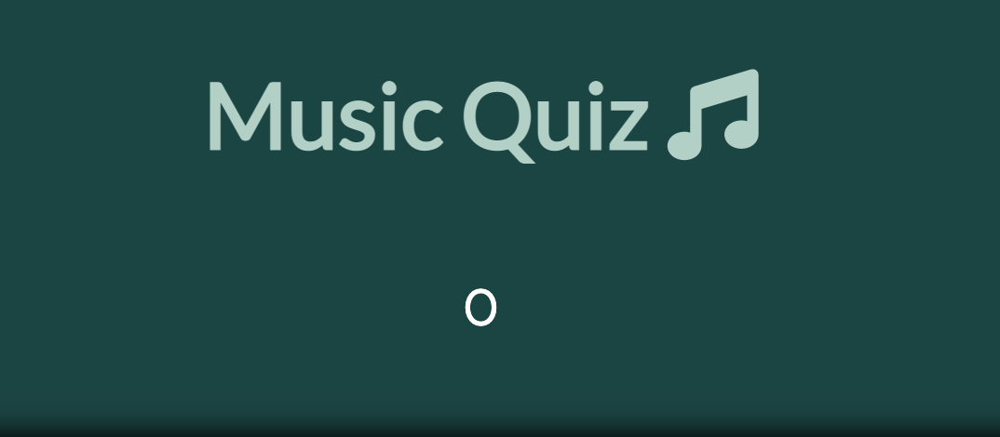
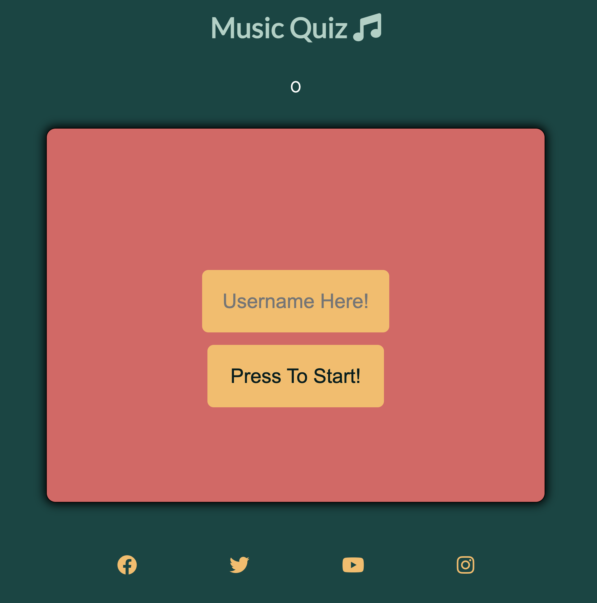
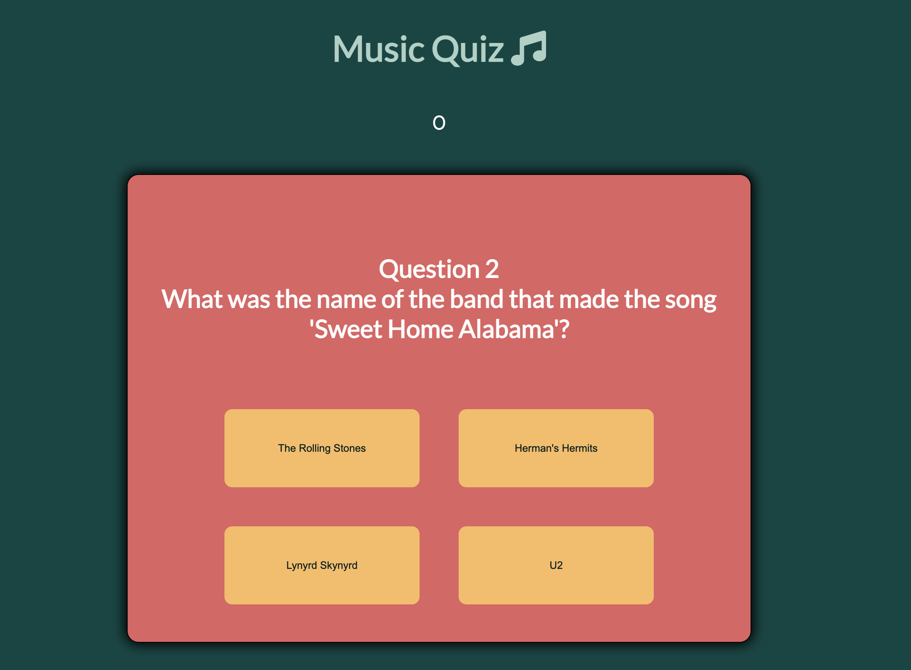
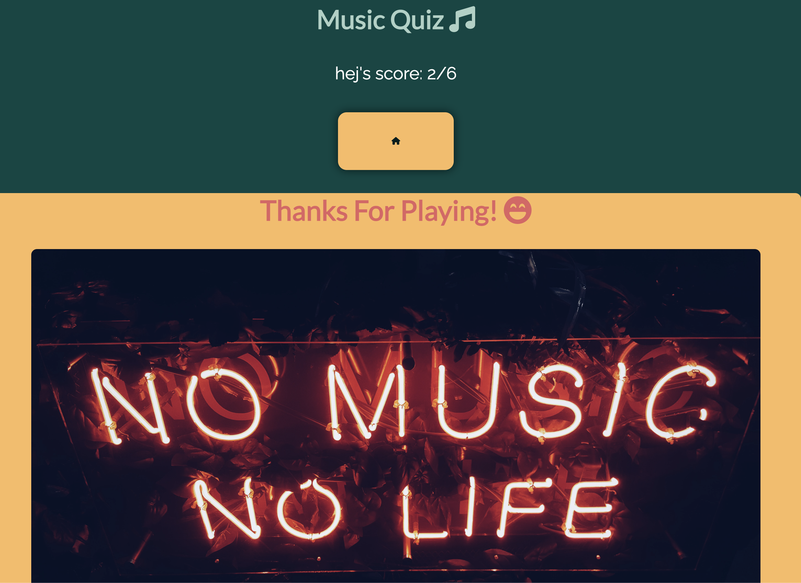
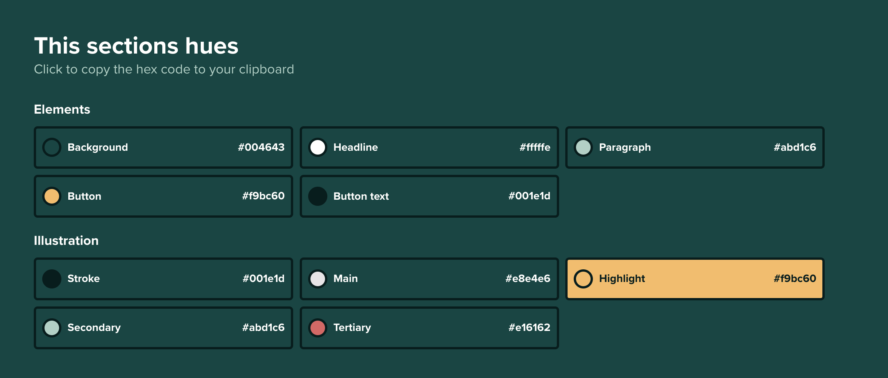
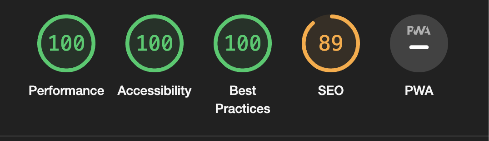
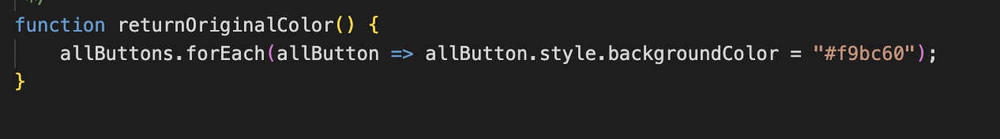

# Welcome to my Music Quiz project

 This project is my first one using JavaScript with HTML and CSS combined. The site has 6 questions with a score count and visual feedback if the answer is correct or wrong. The site also logs the username and pushes it into an array that displays at the beginning and on the final page.

The site's goal is to be a fun and easily accessible quiz. And for me to learn more about JavaScript, HTML and CSS.

## The site on different screen sizes:

## features 

### Navigation
- The navigation is located below the quiz form
- The Button with a Home takes the user back to the home page via the Javascript function
- The button saying next takes you to the next question made by javascript

### Title And Score 
- The score count is made through the JavaScript function. It adds one score every time the user gets the right answer.
- The score is also displayed on the final page but there it is also set in the context of the user's name

### Login form and submit/start quiz button 
- The login form is made by an input text type and a button type of submit
- The form is JavaScript interactive so that the username logs and is then pushed into an array with usernames
- The username gives the game an added seriousness so that you feel as if you played the game non-anonymous

## The Game 

### The quiz is built through javascript and it's the javascript that changes the answers and the questions.
- The quiz is correcting the answers through an array located inside the Javascript. 
- if the user clicks the correct answer button an alert will be displayed telling the user that they did it correctly, if the user is wrong they will also be noticed by an alert

## Final Page 

### The final page is displayed when the user has answered all the questions
- The final page displays the users score out of the possible amount of achievable scores 
- The final page also contains a picture that makes the final page seem more like a final page

## Colors

## testing of site and bugs

### This site has been tested and verified via:
- CSS
    - The jigsaw CSS validator 
- HTML
    - The W3 HTML validator
- JavaScript validated through Jshint Validator
    - The metrics delivered from the Jshint:
        - There are 8 functions in this file.
        - Function with the largest signature take 1 argument, while the median is 0.
        - Largest function has 11 statements in it, while the median is 5.
        - The most complex function has a cyclomatic complexity value of 3 while the median is 1.
- Lighthouse accessibility
    - Result from the test is displayed in the picture below

### Manually Tested
The site has been manually tested by me during the building of the site and also the final version

- Steps of manual testing
    - test validation of whitespace in the username
    - displaying the correct answers
    - displaying the incorrect answers
    - score count only adds score when the user gets the answer correct
    - The home button resets the site/app
    - the final page is displaying correctly

### bugs 
- Bug that makes the color changing of the buttons not disappear 
- score not working correctly
- sends user away from the site when submitting username
- validation problem for signup
- Able to cheat by quickly clicking the answer buttons
- Gives wrong answer when answering right

### solved bug / not solved bug
- Problem with the color display when correct/wrong answer is fixed
- Fixed username problem by changing the method and action of the form in HTML
- Bug solved with the displaying of score
- validation for signup fixed
- Fixed the cheating with quick clicking by disabling the buttons after clicked 
- The score count messed with the logic of the scoreCount function, Fixed with re writing of code

## Deployment 
The site was deployed through Github pages 
- [Link to the site ](https://albinhall.github.io/MusicQuiz/)

### steps for deployment
- In the GitHub repository I navigated to the setting section
- In GitHub settings, I navigated to the pages section
- Via Pages, I uploaded the file via the Master Branch and then waited for the site to be deployed

## Credits

### Media credits
- The pictures displayed in the readme.MD file was taken by me
- The picture on the final page is from Unsplash
    - [link to the site](https://unsplash.com/@simon_noh?utm_source=unsplash&utm_medium=referral&utm_content=creditCopyText)
    - credit: Simon Noh
- [The fonts are from Google fonts](https://fonts.google.com/)
- [The icons are from font awesome](https://fontawesome.com/)

### Credits to code
- Inspiration on how to start of the code was taken from Ahmed
    - [Link to the repository](https://github.com/Ahmad528/quizApp/tree/main/quizwuiz)
- Got help from the code institute tutor with a more straightforward es6 code in the returnOriginalColor function
- Also got general guidance from my assigned mentor Jubril Akolade

## Future Project Updates Ideas
- Make the questions randomized 
- Make a list of genres that can be selected by the user
- Highscore board
- Timer for the questions